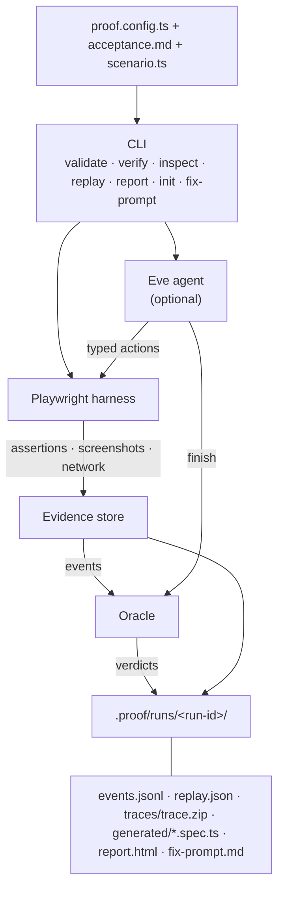

# Skeptic

[](https://www.npmjs.com/package/@pol-cova/skeptic)
[](LICENSE)
[](https://nodejs.org/)
[](https://github.com/pol-cova/Skeptic/actions/workflows/ci.yml)

Your coding agent says it works. Skeptic proves it.

Skeptic is a config-driven verification framework for web applications. You declare acceptance criteria in Markdown, describe browser flows in a typed `scenario.ts` (or let the agent explore with `--no-deterministic`), and Skeptic executes verification through Playwright. Every criterion receives a **deterministic oracle verdict** backed by evidence artifacts and replayable tests.

## How it works

| File              | Role                                                                        |
| ----------------- | --------------------------------------------------------------------------- |
| `proof.config.ts` | App URL, auth env vars, criteria file, scenario module, loop limits         |
| `acceptance.md`   | Numbered acceptance criteria in natural language                            |
| `scenario.ts`     | `buildScenario(context)` → typed browser steps and assertions per criterion |

Skeptic runs against a live app, records screenshots, network observations, and Playwright traces, then applies a **pure function oracle** over typed assertion results. Agent reasoning can propose actions and advisory verdicts, but only deterministic assertions and persisted artifacts can establish `PASS` or `FAIL`.



### Verification modes

| Mode                        | Command                             | Behavior                                                                                                                                                                      |
| --------------------------- | ----------------------------------- | ----------------------------------------------------------------------------------------------------------------------------------------------------------------------------- |
| **Deterministic** (default) | `skeptic verify --deterministic`    | Replays `scenario.ts` with zero model calls. Best for CI gates.                                                                                                               |
| **Agent**                   | `skeptic verify --no-deterministic` | LLM-driven exploration via AI SDK tools (`inspect`, `browserAction`, `assertion`, `captureEvidence`, `finish`). Harness validates every action before Playwright executes it. |

## Deterministic oracle

The oracle (`packages/core/src/oracle.ts`) maps **typed assertion results** and **artifact linkage** to one of four verdicts. Model prose cannot override missing evidence.

### Evaluation order

```text
1. harnessFailure present     → HARNESS_ERROR
2. prerequisiteFailure present → UNVERIFIABLE
3. zero assertions recorded   → UNVERIFIABLE
4. any assertion failed       → FAIL
5. PASS constraints invalid   → UNVERIFIABLE  (model tried to PASS without proof)
6. otherwise                  → PASS
```

### Verdict semantics

| Verdict         | Meaning              | Oracle rule                                                                                                                                                                            |
| --------------- | -------------------- | -------------------------------------------------------------------------------------------------------------------------------------------------------------------------------------- |
| `PASS`          | Criterion satisfied  | Every recorded assertion passed **and** `validatePassConstraints()` succeeds: ≥1 successful assertion **and** ≥1 persisted artifact ref (screenshot/trace path in the evidence store). |
| `FAIL`          | Criterion violated   | ≥1 assertion with `passed: false`. Contradictory UI/network evidence disproves the criterion.                                                                                          |
| `UNVERIFIABLE`  | Prerequisite missing | Upstream criterion did not `PASS`, no assertions were recorded, or the agent/model proposed `PASS`/`FAIL` without satisfying oracle constraints. Not necessarily a product bug.        |
| `HARNESS_ERROR` | Skeptic failed       | Config, origin guard, provider, or harness fault. Never interpreted as a product verdict.                                                                                              |

### PASS constraint gate

`validatePassConstraints()` enforces that `PASS` requires **both**:

- at least one successful deterministic assertion (`visible`, `text`, `count`, `url`, `response`, …)
- at least one artifact reference persisted under `.proof/runs/<run-id>/` (typically a screenshot emitted on `assertion.checked`)

If the agent calls `finish` with `proposedVerdict: "PASS"` but evidence is incomplete, the oracle **downgrades** to `UNVERIFIABLE` with an explicit rejection message.

### Run readiness (aggregate)

Readiness is derived from criterion verdicts with fixed precedence ([ADR 0001](docs/adr/0001-public-contract.md)):

```text
any HARNESS_ERROR → ERROR        (exit 3)
else any FAIL     → NOT_READY    (exit 1)
else any UNVERIFIABLE → INCOMPLETE (exit 2)
else              → READY        (exit 0)
```

## Install

```bash
npm install -g @pol-cova/skeptic@0.2.0
npx playwright install chromium
```

Requires Node.js 24+.

## Quick start

```bash
skeptic init

export PROOF_TEST_USERNAME=your-test-user
export PROOF_TEST_PASSWORD=your-test-password

skeptic validate
skeptic verify --deterministic
```

Explore an unfamiliar UI with the agent, then codify flows in `scenario.ts` and switch back to deterministic mode for CI:

```bash
export SKEPTIC_PROVIDER=openrouter
export OPENROUTER_API_KEY=...
skeptic verify --no-deterministic
```

When verification fails, Skeptic writes `.proof/runs/<run-id>/fix-prompt.md` with evidence-backed remediation steps for your coding agent. Skeptic does not modify your code or create commits.

## Changelog

### 0.2.0

- **Agent verification in CLI** — `skeptic verify --no-deterministic` runs an AI SDK tool loop per criterion (`inspect`, `browserAction`, `assertion`, `captureEvidence`, `finish`) with the same oracle and evidence pipeline as deterministic mode.
- **Phase 1 tooling** — `skeptic validate` preflight; self-contained `skeptic init` TypeScript scaffold; trace links in reports; no demo-specific prerequisite defaults.
- **Phase 2 tooling** — `skeptic inspect`; `--headed`, `--latest`, `--artifact-root`, `--compact-json`; config auto-discovery; rich verify JSON; self-contained replay with app startup from run metadata.

### 0.1.1

- Generic verification tool release: typed `scenario.ts`, deterministic replay, evidence store, HTML/Markdown reports, fix prompts.

### 0.1.0

- Initial npm publish of `@pol-cova/skeptic` with core CLI and demo-oriented workflows.

## Documentation

| Guide                                              | Description                                    |
| -------------------------------------------------- | ---------------------------------------------- |
| [Getting started](docs/getting-started.md)         | End-to-end setup for your application          |
| [Configuration](docs/configuration.md)             | `proof.config.ts` reference                    |
| [Acceptance criteria](docs/acceptance-criteria.md) | Writing `acceptance.md`                        |
| [Scenarios](docs/scenarios.md)                     | Browser actions, assertions, and `scenario.ts` |
| [CLI reference](docs/cli.md)                       | Commands, exit codes, and artifacts            |
| [CI and workflows](docs/ci-and-workflows.md)       | Pipelines, replay, and fix prompts             |
| [Agent mode](docs/agent.md)                        | Eve / `--no-deterministic` verification        |
| [Responsible use](docs/responsible-use.md)         | Credentials, artifacts, and limits             |

## CLI overview

```bash
skeptic init [--force] [--provider chatgpt]
skeptic validate [--config proof.config.ts] [--check-app]
skeptic verify [--deterministic | --no-deterministic] [--headed]
skeptic inspect [--url <url>] [--headed]
skeptic replay [--latest | --run <run-id>] [--artifact-root <path>]
skeptic report [--latest | --run <run-id>] [--open]
skeptic fix-prompt [--latest | --run <run-id>]
```

Artifacts are written under `.proof/runs/<run-id>/` (metadata, events, screenshots, traces, replay bundle, generated Playwright spec, HTML/Markdown report).

## Development

From source (Node.js 24, pnpm 10.7):

```bash
git clone https://github.com/pol-cova/Skeptic.git
cd Skeptic
pnpm install
pnpm typecheck && pnpm test && pnpm lint && pnpm build
```

See [CONTRIBUTING.md](CONTRIBUTING.md) for contribution guidelines.

| Path                          | Package                                                 |
| ----------------------------- | ------------------------------------------------------- |
| `packages/core`               | Config schema, criteria parser, oracle, run plan        |
| `packages/playwright-harness` | Typed browser actions, origin guard, scenario replay    |
| `packages/evidence`           | Event store, artifact layout                            |
| `packages/report`             | HTML/Markdown report and fix-prompt generation          |
| `packages/cli`                | `skeptic` binary                                        |
| `agent/`                      | Eve verification agent (interactive dev via `pnpm dev`) |

## License

Apache-2.0 — see [LICENSE](LICENSE).
