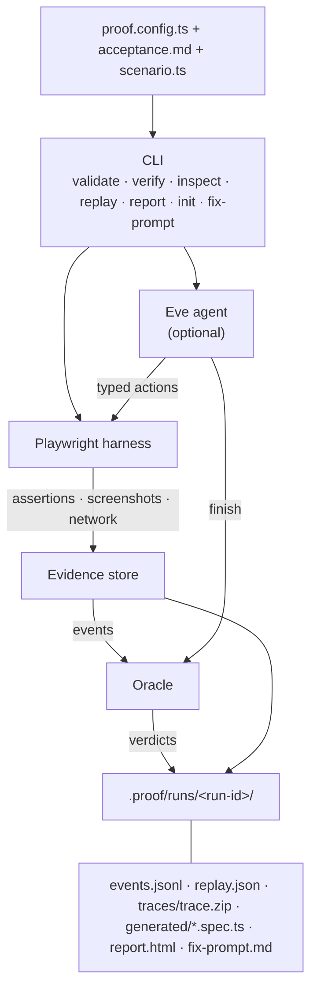

# Skeptic

[](https://www.npmjs.com/package/@pol-cova/skeptic)
[](LICENSE)
[](https://nodejs.org/)
[](https://github.com/pol-cova/Skeptic/actions/workflows/ci.yml)

Your coding agent says it works. Skeptic proves it.

Skeptic is a config-driven verification framework for web applications. You declare acceptance criteria in Markdown, describe browser flows in a typed `scenario.ts`, and Skeptic executes them through Playwright — with an optional adaptive agent (Eve) when flows are uncertain. Every criterion receives a deterministic verdict backed by evidence artifacts and replayable tests.

## How it works

| File | Role |
| --- | --- |
| `proof.config.ts` | App URL, auth env vars, criteria file, scenario module, loop limits |
| `acceptance.md` | Numbered acceptance criteria in natural language |
| `scenario.ts` | `buildScenario(context)` → typed browser steps and assertions per criterion |

Skeptic replays your scenario against a live app, records screenshots and network observations, and applies a deterministic oracle. Agent reasoning can guide exploration, but only typed assertions establish `PASS` or `FAIL`.



**Deterministic verification** (`skeptic verify --deterministic`, the default): loads `scenario.ts`, replays typed browser actions, evaluates assertions — zero model calls. Use for CI gates and fast feedback.

**Agent verification** (`skeptic verify --no-deterministic`): Eve interprets criteria and proposes actions within configurable step, duration, and inference limits; the harness validates every action before Playwright executes it.

## Verdict contract

| Verdict | Meaning | Oracle rule |
| --- | --- | --- |
| `PASS` | Criterion satisfied | ≥1 passing deterministic assertion, none failing |
| `FAIL` | Criterion violated | ≥1 failing assertion |
| `UNVERIFIABLE` | Prerequisite missing | Blocked flow; not necessarily a product bug |
| `HARNESS_ERROR` | Skeptic failed | Config, origin guard, or harness fault |

| Readiness | Exit code | When |
| --- | ---: | --- |
| `READY` | 0 | All criteria `PASS` |
| `NOT_READY` | 1 | Any `FAIL` |
| `INCOMPLETE` | 2 | Any `UNVERIFIABLE` |
| `ERROR` | 3 | Any `HARNESS_ERROR` |

Full contract: [docs/adr/0001-public-contract.md](docs/adr/0001-public-contract.md).

## Install

```bash
npm install -g @pol-cova/skeptic
npx playwright install chromium
```

Requires Node.js 24+.

## Quick start

```bash
skeptic init

export PROOF_TEST_USERNAME=your-test-user
export PROOF_TEST_PASSWORD=your-test-password

# Edit proof.config.ts, acceptance.md, and scenario.ts for your app
skeptic verify --config proof.config.ts --deterministic
```

When verification fails, Skeptic writes `.proof/runs/<run-id>/fix-prompt.md` with evidence-backed remediation steps for your coding agent. Skeptic does not modify your code or create commits.

## Documentation

| Guide | Description |
| --- | --- |
| [Getting started](docs/getting-started.md) | End-to-end setup for your application |
| [Configuration](docs/configuration.md) | `proof.config.ts` reference |
| [Acceptance criteria](docs/acceptance-criteria.md) | Writing `acceptance.md` |
| [Scenarios](docs/scenarios.md) | Browser actions, assertions, and `scenario.ts` |
| [CLI reference](docs/cli.md) | Commands, exit codes, and artifacts |
| [CI and workflows](docs/ci-and-workflows.md) | Pipelines, replay, and fix prompts |
| [Agent mode](docs/agent.md) | Optional Eve verification agent |
| [Responsible use](docs/responsible-use.md) | Credentials, artifacts, and limits |

## CLI overview

```bash
skeptic init [--force] [--provider chatgpt]
skeptic validate [--config proof.config.ts] [--check-app]
skeptic verify [--config proof.config.ts] [--deterministic | --no-deterministic] [--headed]
skeptic inspect [--url <url>] [--headed]
skeptic replay [--latest | --run <run-id>] [--artifact-root <path>]
skeptic report [--latest | --run <run-id>] [--open]
skeptic fix-prompt [--latest | --run <run-id>]
```

Artifacts are written under `.proof/runs/<run-id>/` (metadata, events, screenshots, replay bundle, generated Playwright spec, HTML/Markdown report).

## Development

From source (Node.js 24, pnpm 10.7):

```bash
git clone https://github.com/pol-cova/Skeptic.git
cd Skeptic
pnpm install
pnpm typecheck && pnpm test && pnpm lint && pnpm build
```

See [CONTRIBUTING.md](CONTRIBUTING.md) for contribution guidelines.

| Path | Package |
| --- | --- |
| `packages/core` | Config schema, criteria parser, oracle, run plan |
| `packages/playwright-harness` | Typed browser actions, origin guard, scenario replay |
| `packages/evidence` | Event store, artifact layout |
| `packages/report` | HTML/Markdown report and fix-prompt generation |
| `packages/cli` | `skeptic` binary |
| `agent/` | Eve verification agent |

## License

Apache-2.0 — see [LICENSE](LICENSE).
