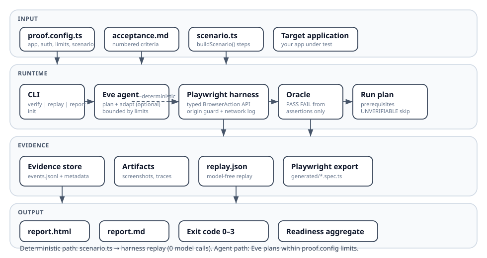

# Skeptic

[](https://www.npmjs.com/package/@pol-cova/skeptic)
[](LICENSE)
[](https://nodejs.org/)
[](https://github.com/pol-cova/Skeptic/actions/workflows/ci.yml)

Your coding agent says it works. Skeptic proves it.

Skeptic is a config-driven verification framework for web applications. You declare acceptance criteria in Markdown, describe browser flows in a typed `scenario.ts`, and Skeptic executes them through Playwright — optionally with an adaptive agent (Eve) when flows are uncertain. Every criterion receives a deterministic verdict backed by evidence artifacts and replayable tests.

## What you configure

| File              | Role                                                                      |
| ----------------- | ------------------------------------------------------------------------- |
| `proof.config.ts` | App URL, auth env vars, criteria file, scenario module, loop limits       |
| `acceptance.md`   | Numbered acceptance criteria (natural language)                           |
| `scenario.ts`     | `buildScenario(context)` → typed browser steps + assertions per criterion |

Skeptic is **not** a hardcoded demo runner. The reference invite app in `examples/demo-app/` is one implementation of `scenario.ts`. Any app with a login flow and test credentials can use the same contract.

## Architecture



```text
proof.config.ts + acceptance.md + scenario.ts
                    │
                    ▼
              ┌──────────┐
              │   CLI    │  verify | replay | report | init | fix-prompt
              └────┬─────┘
                   │
     ┌─────────────┴─────────────┐
     │                           │
     ▼                           ▼
┌─────────┐              ┌───────────────┐
│ Eve     │  (optional)  │ Playwright    │
│ agent   │─────────────►│ harness       │
└────┬────┘  typed actions└───────┬───────┘
     │ finish (advisory)          │ assertions, screenshots, network
     ▼                            ▼
┌─────────┐              ┌───────────────┐
│ Oracle  │◄── events ───│ Evidence store│
└────┬────┘              └───────┬───────┘
     │ verdicts                  │ finalize
     ▼                           ▼
        .proof/runs/<run-id>/
        events.jsonl, replay.json, generated/*.spec.ts, report.html, fix-prompt.md
```

**Deterministic path** (`--deterministic`): loads `scenario.ts`, replays typed `BrowserAction` steps, evaluates assertions — zero model calls. Use for CI gates and fast feedback.

**Agent path**: Eve interprets criteria, proposes actions within configurable step/duration/inference limits; harness validates every action before Playwright executes it.

## Verdict contract

| Verdict         | Meaning              | Oracle rule                                      |
| --------------- | -------------------- | ------------------------------------------------ |
| `PASS`          | Criterion satisfied  | ≥1 passing deterministic assertion, none failing |
| `FAIL`          | Criterion violated   | ≥1 failing assertion                             |
| `UNVERIFIABLE`  | Prerequisite missing | Blocked flow, not necessarily a product bug      |
| `HARNESS_ERROR` | Skeptic failed       | Config, origin guard, or harness fault           |

Aggregate readiness (exit code): `READY` (0) → all PASS; `NOT_READY` (1) → any FAIL; `INCOMPLETE` (2) → any UNVERIFIABLE; `ERROR` (3) → any HARNESS_ERROR.

Full contract: [docs/adr/0001-public-contract.md](docs/adr/0001-public-contract.md).

## Install

```bash
npm install -g @pol-cova/skeptic
npx playwright install chromium
```

Development from source:

```bash
git clone https://github.com/pol-cova/Skeptic.git
cd Skeptic
pnpm install
```

Requires Node.js 24 and pnpm 10.7 for monorepo development.

## Bring your own app

```bash
skeptic init
```

This writes `proof.config.ts`, `scenario.ts`, and `acceptance.md` in the current directory. Then:

1. Edit the config and scenario to match your app (selectors, URLs, criteria).
2. Set credentials and run:

```bash
export PROOF_TEST_USERNAME=...
export PROOF_TEST_PASSWORD=...
skeptic verify --config proof.config.ts --deterministic
```

Or copy the template manually:

```bash
cp docs/proof.config.template.ts proof.config.ts
```

## Reference demo

The invite demo exercises three criteria (login, invalid email, persistence):

```bash
pnpm demo:dev
export PROOF_TEST_USERNAME=demo
export PROOF_TEST_PASSWORD=skeptic-demo

pnpm skeptic verify --config examples/demo-app/proof.config.ts --deterministic
```

Broken vs fixed behavior:

| Phase                                   | C1   | C2   | C3           | Exit |
| --------------------------------------- | ---- | ---- | ------------ | ---- |
| Broken (default)                        | PASS | FAIL | UNVERIFIABLE | 1    |
| Fixed (`DEMO_PERSIST_INVITATIONS=true`) | PASS | PASS | PASS         | 0    |

## CLI

```bash
skeptic verify --config proof.config.ts [--deterministic] [--headless]
skeptic replay --run <run-id>
skeptic report --run <run-id> [--open]
skeptic fix-prompt --run <run-id>
skeptic init [--force] [--provider chatgpt]
```

### Artifacts

```text
.proof/runs/<run-id>/
├── metadata.json
├── events.jsonl
├── replay.json
├── generated/acceptance.spec.ts
├── screenshots/
├── network/observations.json
├── report.html
├── report.md
└── fix-prompt.md   # when exit != 0 (FAIL / UNVERIFIABLE)
```

## Agent (Eve)

For exploratory verification when you do not have a complete `scenario.ts`:

```bash
pnpm dev   # starts Eve with browser tools
```

Provider credentials via environment or local login (`codex login` for ChatGPT). See [ADR 0002](docs/adr/0002-model-provider-strategy.md). Deterministic verify never calls a model.

## Development

```bash
pnpm typecheck
pnpm test
pnpm lint
pnpm build
pnpm gate:demo   # integration gate against examples/demo-app
```

| Path                          | Package                                              |
| ----------------------------- | ---------------------------------------------------- |
| `packages/core`               | Config schema, criteria parser, oracle, run plan     |
| `packages/playwright-harness` | Typed browser actions, origin guard, scenario replay |
| `packages/evidence`           | Event store, artifact layout                         |
| `packages/report`             | HTML/Markdown report generation                      |
| `packages/cli`                | `skeptic` binary                                     |
| `agent/`                      | Eve verification agent                               |

## License

Apache-2.0 — see [LICENSE](LICENSE).
