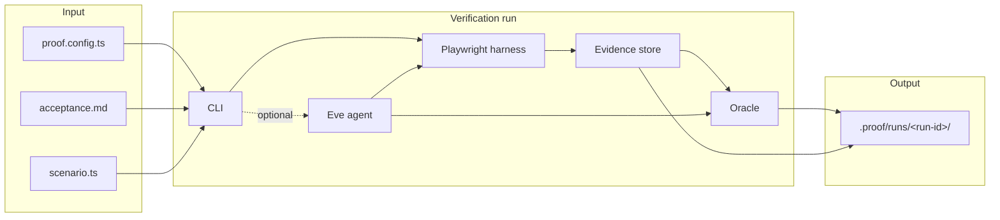

# Skeptic documentation

Skeptic verifies web applications against acceptance criteria you define. It runs typed browser flows through Playwright, records evidence, and returns deterministic verdicts suitable for CI and coding-agent workflows.

## Architecture



Only deterministic assertions establish `PASS` or `FAIL`. See [ADR 0001](adr/0001-public-contract.md).

## Guides

### Setup and daily use

1. **[Getting started](getting-started.md)** — Install Skeptic, scaffold a project, run your first verification.
2. **[Configuration](configuration.md)** — Every field in `proof.config.ts`, app lifecycle, auth, and limits.
3. **[Acceptance criteria](acceptance-criteria.md)** — How to write numbered criteria in `acceptance.md`.
4. **[Scenarios](scenarios.md)** — Implement `buildScenario()`, browser actions, element targets, and assertions.

### Operations

5. **[CLI reference](cli.md)** — Commands, JSON output, exit codes, and artifact layout.
6. **[CI and workflows](ci-and-workflows.md)** — GitHub Actions, replay, reports, and fix prompts for agents.
7. **[Agent mode](agent.md)** — Optional Eve agent when you need exploratory verification.

### Reference

- **[Responsible use](responsible-use.md)** — Credentials, sensitive artifacts, and scope limits.
- **[ADR 0001: Public contract](adr/0001-public-contract.md)** — Frozen verdict and readiness semantics.
- **[ADR 0002: Model providers](adr/0002-model-provider-strategy.md)** — LLM provider configuration for agent mode.
- **[Google AI integration](GOOGLE-AI-INTEGRATION.md)** — Native Gemini setup and troubleshooting.
- **[Preflight checks](preflight.md)** — Toolchain validation for contributors.

## Typical workflow

```bash
skeptic init
# Edit proof.config.ts, acceptance.md, scenario.ts

export PROOF_TEST_USERNAME=...
export PROOF_TEST_PASSWORD=...

skeptic verify --config proof.config.ts --deterministic
skeptic report --run <run-id> --open    # inspect evidence
skeptic fix-prompt --run <run-id>       # hand off to a coding agent
```

Deterministic verification makes zero model calls and is the recommended default for CI.
